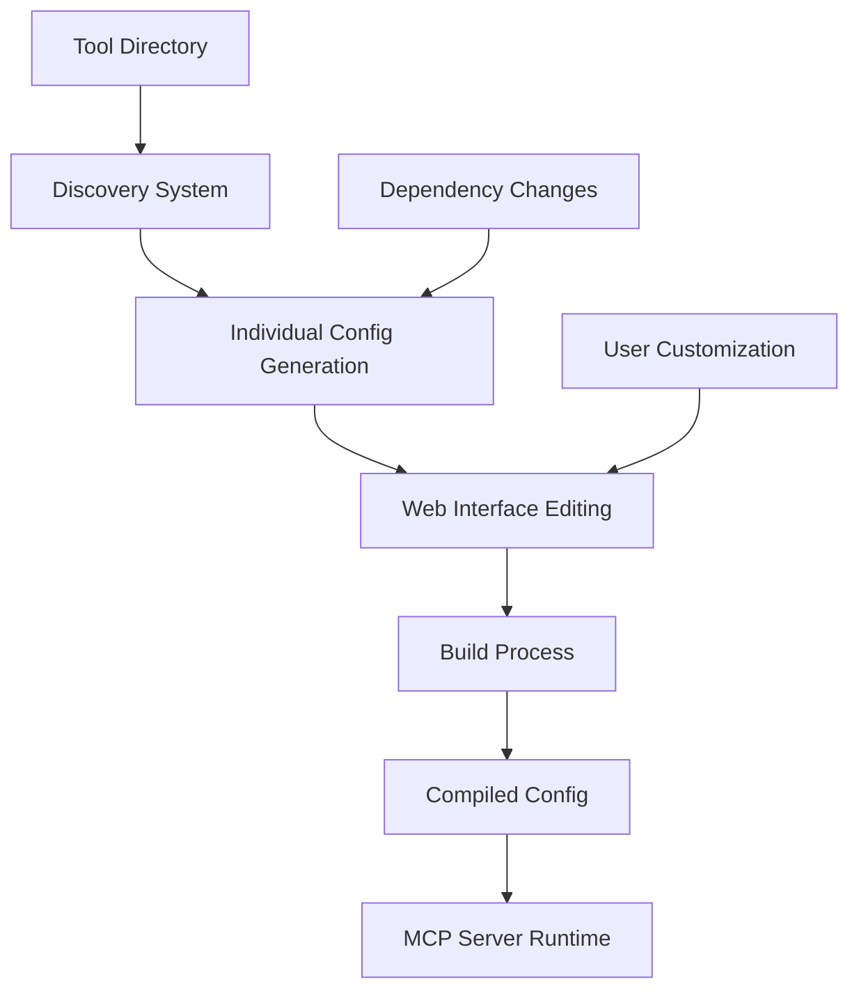

# Configuration Management

The Local MCP Server uses a sophisticated dual-configuration system that provides both automatic discovery and fine-grained control over tool behavior. This guide explains the configuration architecture, management workflows, and customization options.

## Configuration Architecture

### Dual Configuration System

```
Individual Configs        Compilation         Runtime Config
config/tools/*.json  →   build_tools.py  →   config/tools.json  →  MCP Server
     (editable)           (build process)       (server format)       (runtime)
```

The system maintains two complementary configuration layers:

1. **Individual Tool Configs**: Rich, user-editable configurations for each tool
2. **Compiled Config**: Optimized, flattened configuration consumed by the MCP server

### Configuration Flow



## Individual Tool Configurations

### Location and Format
- **Path**: `server/config/tools/{tool-name}.json`
- **Format**: JSON with rich metadata structure
- **Management**: Auto-generated by discovery, edited via web interface
- **Persistence**: Maintained across server restarts and updates

### Configuration Schema

```json
{
  "enabled": true,
  "last_modified": "2025-09-23T11:07:01.299Z",
  "auto_detected": true,
  "created_by": "discovery_tool",
  "tags": ["system", "monitoring"],
  "script_config": {
    "name": "system-info",
    "description": "System information and monitoring utilities",
    "script_path": "system-info/run.py", 
    "script_type": "python",
    "requires_confirmation": true,
    "parameters": [
      {
        "name": "action",
        "type": "string",
        "description": "Action to perform",
        "default": "get_info",
        "required": true
      }
    ],
    "interactive": false,
    "wrapper_function": null,
    "dependencies": ["psutil", "fire"],
    "examples": [
      {
        "description": "Get system information",
        "command": "get_system_info",
        "parameters": {"format": "json"}
      }
    ],
    "timeout": 30,
    "max_retries": 3
  }
}
```

### Field Descriptions

#### Top-Level Metadata
- **enabled**: Whether tool is active and available to MCP clients
- **last_modified**: Timestamp of last configuration change
- **auto_detected**: Whether tool was discovered automatically  
- **created_by**: Source of configuration (discovery_tool, user, import)
- **tags**: Organizational tags for filtering and management

#### Script Configuration
- **name**: Tool identifier (must match directory name)
- **description**: Human-readable tool description
- **script_path**: Relative path from tools/ to entry point
- **script_type**: Type of script (python, shell, executable)
- **requires_confirmation**: Whether tool needs user confirmation before execution
- **interactive**: Whether tool requires user interaction during execution
- **parameters**: Array of parameter definitions with types and validation
- **dependencies**: List of required packages/modules
- **examples**: Usage examples for documentation and testing
- **timeout**: Maximum execution time in seconds
- **max_retries**: Number of retry attempts on failure

## Compiled Configuration

### Purpose and Format
- **Path**: `server/config/tools.json`
- **Format**: Flattened JSON optimized for server consumption
- **Generation**: Created by `build_tools.py` from individual configs
- **Usage**: Loaded by MCP server at startup for tool registration

### Compiled Structure

```json
{
  "system-info": {
    "name": "system-info",
    "description": "System information and monitoring utilities",
    "script_path": "system-info/run.py",
    "script_type": "python", 
    "requires_confirmation": true,
    "parameters": [...],
    "interactive": false,
    "wrapper_function": null,
    "dependencies": ["psutil", "fire"],
    "examples": [...],
    "enabled": true,
    "tags": ["system", "monitoring"]
  }
}
```

### Compilation Process

The build process:
1. **Reads** all individual configs from `config/tools/*.json`
2. **Validates** configuration syntax and required fields
3. **Filters** only enabled tools for inclusion
4. **Extracts** script_config portion and merges with metadata
5. **Validates** dependencies and parameter definitions
6. **Writes** compiled configuration to `config/tools.json`

## Configuration Management Workflows

### Automatic Discovery Workflow

```bash
cd server/

# 1. Scan for new tools
python discover_tools.py

# 2. Compile configurations  
python build_tools.py

# 3. Restart server to load new tools
./start_server.sh --host claude-desktop
```

### Manual Configuration Workflow

```bash
# 1. Edit individual config via web interface
# Open http://localhost:3000, navigate to tool configuration

# 2. Or edit JSON directly
vim config/tools/my-tool.json

# 3. Rebuild compiled config
python build_tools.py

# 4. Restart server
./start_server.sh --host claude-desktop
```

### Bulk Configuration Management

```bash
# Export all configurations
python -c "
import json
from pathlib import Path
configs = {}
for f in Path('config/tools').glob('*.json'):
    if f.name != 'tools.json':
        configs[f.stem] = json.loads(f.read_text())
Path('config-backup.json').write_text(json.dumps(configs, indent=2))
print('Configurations exported to config-backup.json')
"

# Import configurations
python -c "
import json
from pathlib import Path
configs = json.loads(Path('config-backup.json').read_text())
for name, config in configs.items():
    Path(f'config/tools/{name}.json').write_text(json.dumps(config, indent=2))
print(f'Imported {len(configs)} configurations')
"
```

## Web Interface Configuration

### Tool Management Interface
- **Tool List**: Overview of all discovered tools with status
- **Configuration Editor**: Form-based editing with validation
- **Parameter Manager**: Visual parameter definition and testing
- **Dependency Manager**: One-click dependency installation
- **Status Monitor**: Real-time tool health and execution status

### Configuration Features
- **Real-time Validation**: Immediate feedback on configuration errors
- **Parameter Testing**: Built-in tool testing with parameter validation
- **Configuration Templates**: Pre-built configurations for common patterns
- **Bulk Operations**: Mass enable/disable, tag management, export/import
- **Change Tracking**: History of configuration modifications

### Web Interface Workflow
1. Navigate to http://localhost:3000
2. Select tool from tool list
3. Click "Configure" to open configuration editor
4. Modify settings using form interface
5. Click "Save" to update individual config
6. System automatically triggers compilation
7. Changes take effect on next server restart

## Advanced Configuration

### Custom Parameter Types

```json
{
  "parameters": [
    {
      "name": "file_path",
      "type": "file",
      "description": "Path to input file",
      "validation": {
        "exists": true,
        "readable": true,
        "extensions": [".txt", ".json", ".csv"]
      }
    },
    {
      "name": "output_format", 
      "type": "enum",
      "description": "Output format",
      "choices": ["json", "csv", "xml"],
      "default": "json"
    },
    {
      "name": "options",
      "type": "object",
      "description": "Advanced options",
      "properties": {
        "verbose": {"type": "boolean", "default": false},
        "timeout": {"type": "integer", "minimum": 1, "maximum": 300}
      }
    }
  ]
}
```

### Environment-Specific Configuration

```json
{
  "script_config": {
    "environment_variables": {
      "TOOL_DEBUG": "1",
      "TOOL_CONFIG_PATH": "/path/to/tool/config"
    },
    "runtime_environment": {
      "working_directory": "relative/path/from/tool/root",
      "python_path_additions": ["./lib", "./vendor"],
      "environment_inheritance": true
    }
  }
}
```

### Tool Security Configuration

```json
{
  "script_config": {
    "security": {
      "requires_confirmation": true,
      "confirmation_message": "This tool will modify system files. Continue?",
      "sandbox_enabled": true,
      "allowed_file_patterns": ["./data/*", "/tmp/tool-*"],
      "blocked_file_patterns": ["~/.ssh/*", "/etc/*"],
      "network_access": "restricted",
      "allowed_domains": ["api.example.com", "data.service.com"]
    }
  }
}
```

## Configuration Templates

### System Tool Template

```json
{
  "enabled": true,
  "tags": ["system", "monitoring"],
  "script_config": {
    "requires_confirmation": false,
    "interactive": false,
    "timeout": 30,
    "dependencies": ["psutil"],
    "security": {
      "sandbox_enabled": true,
      "network_access": "none"
    }
  }
}
```

### API Client Template

```json
{
  "enabled": true,
  "tags": ["api", "network"],
  "script_config": {
    "requires_confirmation": true,
    "interactive": false,
    "timeout": 60,
    "dependencies": ["requests", "urllib3"],
    "security": {
      "network_access": "allowed",
      "allowed_domains": ["*.api.com"]
    }
  }
}
```

### File Processing Template

```json
{
  "enabled": true,
  "tags": ["file", "processing"],
  "script_config": {
    "requires_confirmation": true,
    "interactive": false,
    "timeout": 120,
    "dependencies": ["pandas", "openpyxl"],
    "security": {
      "sandbox_enabled": true,
      "allowed_file_patterns": ["./input/*", "./output/*"]
    }
  }
}
```

## Troubleshooting Configuration

### Common Configuration Issues

**Problem**: Tool not appearing after configuration
```bash
# Check individual config syntax
python -m json.tool config/tools/my-tool.json

# Verify compilation
python build_tools.py

# Check server logs
tail -f config/server.log
```

**Problem**: Parameter validation errors
```bash
# Test parameter definitions
python -c "
import json
config = json.loads(open('config/tools/my-tool.json').read())
for param in config['script_config']['parameters']:
    print(f'Parameter: {param[\"name\"]} ({param[\"type\"]})')
"
```

**Problem**: Dependencies not installing
```bash
# Check dependency specification
grep -A 10 dependencies config/tools/my-tool.json

# Test manual installation
cd tools/my-tool
pip install -r requirements.txt
```

### Configuration Validation

```bash
# Validate all configurations
python -c "
import json
from pathlib import Path
from jsonschema import validate

# Load schema (if available)
for config_file in Path('config/tools').glob('*.json'):
    if config_file.name != 'tools.json':
        try:
            config = json.loads(config_file.read_text())
            print(f'✅ {config_file.name}: Valid')
        except json.JSONDecodeError as e:
            print(f'❌ {config_file.name}: {e}')
"
```

### Configuration Reset

```bash
# Reset single tool configuration
rm config/tools/my-tool.json
python discover_tools.py  # Regenerates with defaults

# Reset all configurations
rm -f config/tools/*.json config/tools.json
python discover_tools.py
python build_tools.py
```

## Performance Optimization

### Configuration Caching
- Individual configs cached in memory during web interface sessions
- Compiled config loaded once at server startup
- File watchers trigger automatic recompilation on changes
- Lazy loading of tool-specific configuration details

### Large-Scale Configuration Management
- Batch configuration updates via API
- Configuration versioning and rollback capabilities
- Template-based configuration generation
- Automated configuration validation in CI/CD pipelines

This configuration system provides the flexibility needed for both simple setups and complex enterprise deployments while maintaining ease of use through the web interface.